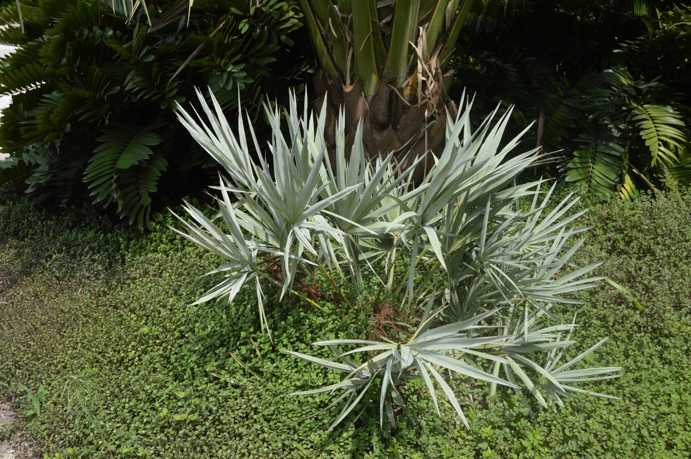

```{r setup, include=FALSE}
knitr::opts_chunk$set(echo = TRUE)

library(tidyverse)
library(here)
```

### Overview

This document explores differences between two species of *Serenoa* using the variables height, weight, length, number of green leaves. The first section, "Preliminary Data Exploration", presents 3 scatterplot visualizations of plant characteristics and how they compare within and between the two species. The second section generates a binomial logistic regression model using plant height, canopy length, canopy width and green leaves as predictor variables to predict differences between these two species. The final section evaluates the success of this model, displaying discrepancies between when the model was correct and incorrect for both species.


{width=70%}

{width=70%}


### Data Explained

This dataset contains plant characteristics for *Serenoa repens* and *Sabal etonia*, at Archbold Biological Station in south-central Florida. Data was collected from 1981 - 2017 in ongoing 5 year intervals.

### Read and Wrangle Data

```{r, echo=TRUE, message=FALSE, warning=FALSE}
#read in csv data
palmetto_data <- read_csv(here("data", "all_palmetto_data.csv")) %>% 
  select(species, height, length, width, green_lvs) %>%  # select only columns to be used for analysis
  mutate(species_name = case_when(
    species == 1 ~ "Serenoa repens",
    species == 2 ~ "Sabal etonia"
  ))
```

### Preliminary Data Exploration

#### Height vs. Length Scatterplot
```{r, echo=TRUE, message=FALSE, warning=FALSE}
ggplot(data = palmetto_data, aes(x = height, y=length)) +
  geom_point(aes(color=species_name)) +
  labs(
    title = 'Height vs. length for Sabla etonia and Serenoa repens (1981-2017)',
    x = 'Height (cm)',
    y = 'Length (cm)'
  )
```

**Figure 1:** This scatter plot explores displays the relationship between length (cm) and height (cm) for *Sabal etonia* and *Serenoa repens*.

Key Takeaway: Height and length for both plants have a strong linear positively correlation. Across the dataset, *Sabal etonia* appears to be longer and taller than *Serenoa repens*.

####
```{r}

```

### Citation

Abrahamson, W.G. 2019. Survival, growth and biomass estimates of two dominant palmetto species of south-central Florida from 1981 - 2017, ongoing at 5-year intervals ver 1. Environmental Data Initiative. https://doi.org/10.6073/pasta/f2f96ec76fbbd4b9db431c79a770c4d5 (Accessed 2021-02-07).
